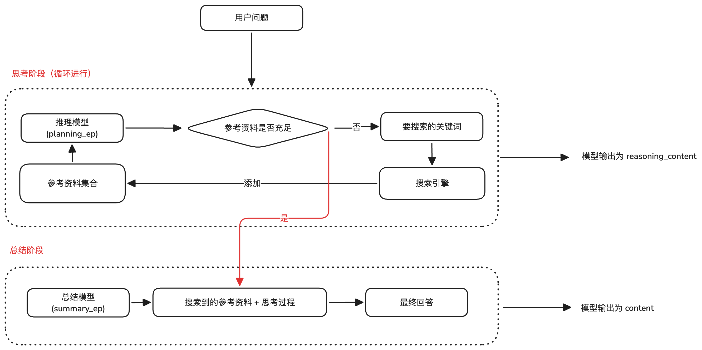
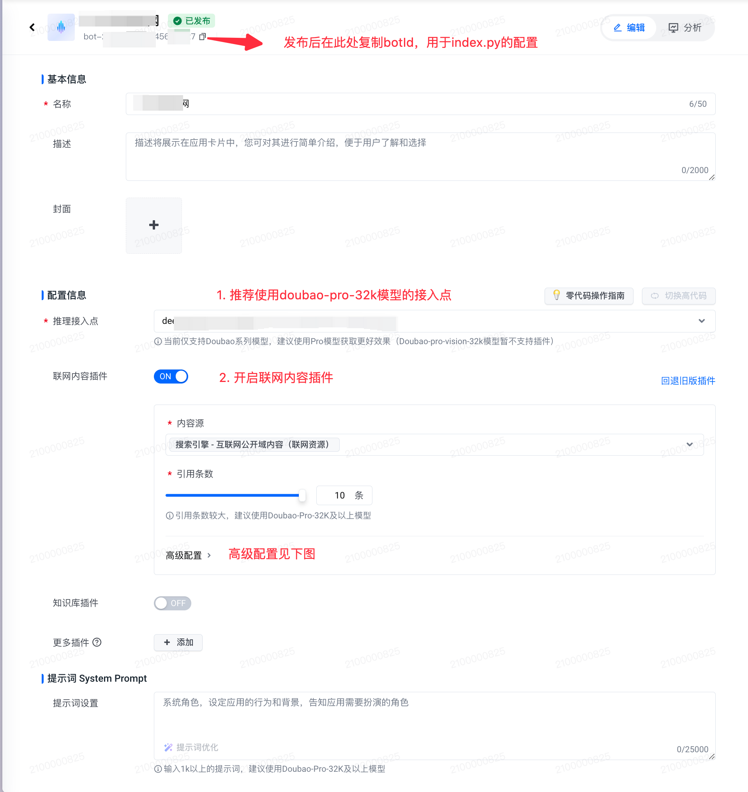
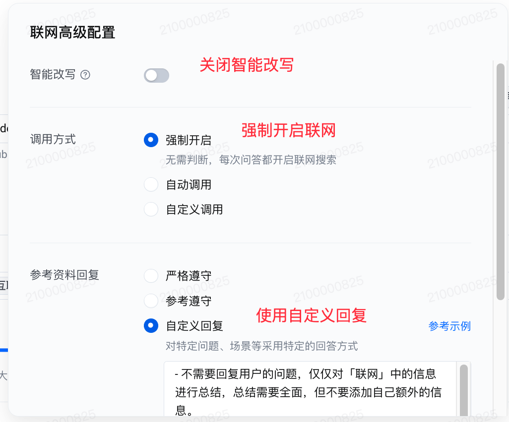

# 深度搜索 Deep Research

## 应用介绍

TODO: by PM

## 费用说明

TODO: by PM

## 环境准备

- Poetry 1.6.1 版本
- Python 版本要求大于等于 3.8.1，小于 3.12
- 火山方舟 API
  KEY [参考文档](https://www.volcengine.com/docs/82379/1298459#api-key-%E7%AD%BE%E5%90%8D%E9%89%B4%E6%9D%83)
- 火山引擎 AK SK [参考文档](https://www.volcengine.com/docs/6291/65568)
- 创建 DeepSeek-R1 的endpoint [参考文档](https://www.volcengine.com/docs/82379/1099522)
- （可选）创建火山方舟零代码联网应用 [参考文档](https://www.volcengine.com/docs/82379/1267885)
- （可选）开源搜索引擎Tavily APIKEY [参考文档](https://docs.tavily.com/guides/quickstart)

*如果选择使用火山方舟零代码联网应用作为搜索引擎实现，您可参考附录中的推荐配置创建对应的零代码联网应用*

## 快速入门

本文为您介绍如何在本地快速部署 live voice call 项目。

1. 下载代码库

    ```shell
    git clone https://github.com/volcengine/ai-app-lab.git
    cd demohouse/deep_research
    ```

2. 修改配置

- 修改`index.py`

    ```python
    # 方舟APIKEY 
    ARK_API_KEY = "{YOUR_ARK_API_KEY}"
    # 推理模型接入点ID，推荐使用Deepseek-R1模型（非蒸馏版本） 
    REASONING_EP_ID = "{YOUR_ENDPOINT_ID}"
    # （可选）如果使用tavily作为搜索引擎，填写tavily APIKEY
    TAVILY_API_KEY = "{YOUR_TAVILY_API_KEY}"
    # （可选）如果使用火山方舟零代码联网应用作为搜索引擎，填写对应的botId
    SEARCH_BOT_ID = "{YOUR_BOT_ID}"
    ```

- 修改本地环境变量注入方舟APIKEY

    ```shell
    export ARK_API_KEY={YOUR_API_KEY}
    ```

3. 启动服务端（会默认在localhost:8888提供符合openAI规范的chatAPI服务）

    ```shell
    cd demohouse/deep_research

    python -m venv .venv
    source .venv/bin/activate
    pip install poetry==1.6.1

    poetry install
    poetry run python -m index
    ```

4. 使用火山方舟官方SDK调用服务端，可参考`client_example.py`

    ```python
    from volcenginesdkarkruntime import Ark

    client = Ark(base_url="http://localhost:8888/api/v3")
    
    
    def main():
        # stream run
        stream_resp = client.chat.completions.create(
            model="ep-test",  # useless, only for validation
            messages=[
                {
                    "role": "user",
                    "content": "帮我查一下2024年11月上市的智能手机的价格，并给出一篇有关其中最便宜的一款的网络评测",
                }
            ],
            stream=True,
        )
    
        thinking = False
    
        for chunk in stream_resp:
            if chunk.choices[0].delta.reasoning_content:
                if not thinking:
                    print("\n----思考过程----\n")
                    thinking = True
                print(chunk.choices[0].delta.reasoning_content, end="")
            elif chunk.choices[0].delta.content:
                if thinking:
                    print("\n----输出回答----\n")
                    thinking = False
                print(chunk.choices[0].delta.content, end="")
    
    
    if __name__ == "__main__":
        main()
    ```

## 技术实现



本项目会结合“深度思考”大模型和联网搜索能力，并向上封装成标准的Chat Completion API Server。

在接收到用户的原始问题后，会进行两个阶段的处理：

1. 思考阶段（循环进行）

    此阶段由“推理模型”根据用户问题不断地使用搜索引擎，获取参考资料，直至模型认为收集到的参考资料已经足够解决用户问题

2. 总结阶段

    此阶段由“总结模型”根据上一阶段产出的所有参考资料和思考过程中的模型输出，对用户的问题进行总结性回答

其中思考阶段的模型输出会被整合至`reasoning_content`中，总结阶段的模型输出会被整合至`content`中，对调用方来说，是符合Chat Completion API规范的，因此可以使用OpenAI等大模型SDK轻松接入服务。

## 目录结构

```
.
├── README.md
├── __init__.py
├── client_example.py # 客户端调用示范
├── deep_research.py # 深度搜索核型实现
├── img.png
├── index.py # 服务端启动入口
├── poetry.lock
├── prompt.py # 思考/总结阶段 prompt
├── pyproject.toml
├── requirements.txt
├── search_engine
│   ├── __init__.py
│   ├── search_engine.py
│   ├── tavily.py # tavily 搜索引擎实现
│   └── volc_bot.py # 火山方舟零代码联网应用 搜索引擎实现
└── utils.py # 工具函数

```

## 附录

### 创建推荐配置的零代码联网应用





自定义回复推荐配置：

```
- 不需要回复用户的问题，仅仅对「联网」中的信息进行总结，总结需要全面，但不要添加自己额外的信息。
- 回复请使用清晰、结构化（序号/分段等）的语言，确保可被用户理解和使用。
```