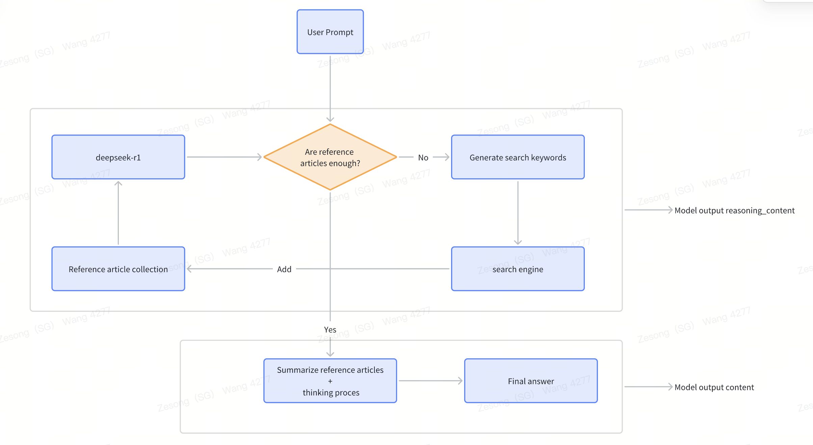

# Overview

Deep Research is a high-efficiency tool built for tackling complex problems. Powered by the DeepSeek-R1, it provides in-depth, multi-angle analysis and integrates online resources to deliver well-rounded solutions quickly. Whether you're conducting academic research, making business decisions, or exploring product insights, Deep Research helps you dive deeper and develop practical, actionable strategies.

## Expense Details

| Type  | Service Name  | Billing Rules      |
| ------- | --------------- | -------------------------------------------------------------------------------------------------------------------------------------------------------------------------------------------- |
| Model | Deepseek - r1 | 500K tokens are given as a free quota upon activation. For usage exceeding this amount, payment is based on the token consumption. For detailed pricing, refer to the [billing description](https://docs.byteplus.com/en/docs/ModelArk/1099320). |
| Search API | Tavily | Pricing |

## Environment Setup

- Poetry Version: 1.6.1
- Python Version: ≥ 3.8.1 and < 3.12
- **Generate an API Key:** Follow the [Obtaining API Key](https://docs.byteplus.com/en/docs/ModelArk/1399008#_1-obtaining-and-configuring-api-key).
- **Create an Inference** **Endpoint** of DeepSeek-R1 Model: Log in to the [ModelArk Console](https://console.byteplus.com/ark/region:ark-stg+ap-southeast-1/endpoint?projectName=default) and create an endpoint.
- (Optional) Get an API key of open-source Search Engine [Tavily](https://app.tavily.com/home)

## Quick Start

1. Clone code repo

   ```shell
   git clone https://github.com/volcengine/ai-app-lab.git
   cd demohouse/deep_research
   ```

2. Set environment variables

    ```shell
    # YOUR ARK API KEY
    export ARK_API_KEY=xxx-xxxx-xxx-xxx

    # your deepseek-r1 model endpoint id
    export REASONING_MODEL_ENDPOINT_ID=ep-xxxxxxxx-xxx

    # set tavily as search engine
    export SEARCH_ENGINE=tavily

    # set your tavily APIKEY
    export TAVILY_API_KEY=xxx-xxx-xxx-xxx
    ```

3. Install dependencies

   > Note
   >
   > Deep research server default runs on localhost:8888, providing OpenAI compatible API
   >

   ```shell
   python -m venv .venv
   source .venv/bin/activate

   poetry install
   poetry run python -m server
   ```

4. Start webui

   ```shell
   # set your deep research server api addr
   export API_ADDR=http://localhost:8888/api/v3/bots

   python -m venv .venv
   source .venv/bin/activate
   poetry install

   # start web ui
   poetry run python -m webui
   ```

5. Open browser and visit `http://localhost:7860/`

   

## Implementation detail

This project integrates a deep-thinking large model with internet search capabilities and packages them into a standard Chat Completion API Server.



After receiving the user's original question, two stages of processing will be carried out:

- Thinking stage (performed in a loop)
  DeepSeek-R1 continuously uses the search engine according to the user's question to obtain reference materials until the model believes that the collected reference materials are sufficient to solve the user's problem.
- Summary stage
  DeepSeek - R1 provides a summary answer to the user's question based on all the reference materials produced in the previous stage and the model outputs during the thinking process.

The model outputs from the thinking stage will be integrated into the reasoning_content field, and the model outputs from the summary stage will be integrated into the content field. This architecture is strictly designed in accordance with the OpenAI Chat Completion API specification. Therefore, developers can directly use the OpenAI standard SDK or compatible interfaces to achieve seamless docking of services, which significantly reduces the complexity of technical integration.

## Project Structure

```shell
├── README.md
├── __init__.py
├── config.py
├── deep_research.py # core logic
├── docs
├── poetry.lock
├── prompt.py # planning/summary prompt
├── pyproject.toml
├── requirements.txt
├── run.sh
├── search_engine
│   ├── __init__.py
│   ├── search_engine.py # search engine interface
│   └── tavily.py # tavily search engine
├── server.py # Server entrypoint
├── utils.py
└── webui.py # webui entrypoint
```
