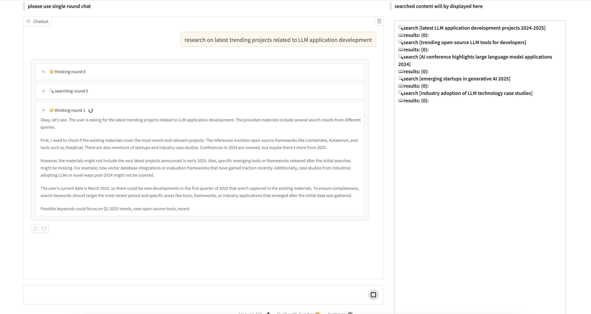

# 深度推理 Deep Research

## 应用介绍

Deep Research 是一款专为应对复杂问题而设计的高效工具，利用 DeepSeek-R1 大模型对复杂问题进行多角度分析，并辅助互联网资料，快速生成最合适用户的解决方案。
无论是在学术研究、企业决策还是产品调研中，Deep Research 都能够有效地协助用户深入挖掘，提出切实可行的解决策略。


## 费用说明

- 推理总结模型计费

  - DeepSeek-R1 大模型：开通赠送500,000 tokens <a href="https://www.volcengine.com/docs/82379/1399514" target="_blank">免费额度</a>，超过部分按 token 使用量付费，详见 <a href="https://www.volcengine.com/docs/82379/1099320#%E5%A4%A7%E8%AF%AD%E8%A8%80%E6%A8%A1%E5%9E%8B" target="_blank">计费说明</a>

  
- 联网搜索服务计费，您可自由选择使用的联网搜索服务

  - 选择一：使用火山方舟零代码联网应用作为搜索引擎，计费项如下
  
    - Doubao-pro-32k/Doubao-1.5-pro-32k，开通赠送500,000 tokens <a href="https://www.volcengine.com/docs/82379/1399514" target="_blank">免费额度</a>，超过部分按 token 使用量付费，价格详见 <a href="https://www.volcengine.com/docs/82379/1099320#%E5%A4%A7%E8%AF%AD%E8%A8%80%E6%A8%A1%E5%9E%8B" target="_blank" >计费说明</a>
    
    - 联网内容插件，价格详见 <a target="_blank" href="https://www.volcengine.com/docs/82379/1338550">计费说明</a>
    
  - 选择二：使用开源搜索引擎 Tavily，由 Tavily 官方进行收费，计费规则详见 <a href="https://tavily.com/#pricing" target="_blank">计费说明</a>
  
  - 选择三：其他 Search API 或者企业内部 Search 接口，火山方舟侧不收取费用

## 环境准备

- Python - 版本要求大于等于 3.9.0，小于 3.12
- Poetry 1.6.1 版本，可参考以下命令安装

  ```
  pip install poetry==1.6.1
  ```

- <a target="_blank" href="https://console.volcengine.com/ark/region:ark+cn-beijing/apiKey">获取火山方舟 API KEY</a> | <a target="_blank" href="https://www.volcengine.com/docs/82379/1298459#api-key-%E7%AD%BE%E5%90%8D%E9%89%B4%E6%9D%83">参考文档</a>
- 在<a target="_blank" href="https://console.volcengine.com/ark/region:ark+cn-beijing/openManagement?LLM=%7B%7D&OpenTokenDrawer=false">开通管理页</a>开通 DeepSeek-R1 模型。
- （可选）如果通过火山方舟高代码应用部署本demo，<a target="_blank" href="https://console.volcengine.com/iam/keymanage/">需获取火山引擎 AK SK</a> | <a target="_blank" href="https://www.volcengine.com/docs/6291/65568"> 参考文档 </a>
- 搜索引擎选择：以下方式任选其一
  - 使用火山方舟零代码联网应用作为搜索引擎，推荐配置参见【附录】，操作步骤详情见 <a target="_blank" href="https://www.volcengine.com/docs/82379/1267885">参考文档</a>
  - 使用开源搜索引擎 Tavily，需获取 Tavily APIKEY <a target="_blank" href="https://docs.tavily.com/guides/quickstart"> 参考文档 </a>

## 快速入门

本文为您介绍如何在本地以及利用火山方舟高代码应用快速部署 Deep Research 项目，本项目可以通过以下两种方式进行部署：

| **方式**      | **说明**                  | **适用场景**                  |
|-------------|-------------------------|---------------------------|
| 本地部署运行     | 本地启动服务和webui      | 本地测试和局域网内部署API服务            |
| 部署火山方舟高代码应用 | 使用火山方舟高代码应用方式托管部署       | 低成本快速实现云端API服务部署 + 对话界面体验 |


### Method 1：Local Run

1. Clone code repo

    ```shell
    git clone https://github.com/volcengine/ai-app-lab.git
    cd demohouse/deep_research
    ```

2. Set environment variables

   - use tavily as search engine

     ```shell
     # YOUR ARK API KEY
     export ARK_API_KEY=xxx-xxxx-xxx-xxx
     
     # your deepseek-r1 model endpoint id
     export REASONING_MODEL_ENDPOINT_ID=ep-xxxxxxxx-xxx
     
     # set tavily as search engine
     export SEARCH_ENGINE=tavily
     
     # set your tavily APIKEY
     export TAVILY_API_KEY=xxx-xxx-xxx-xxx
     ```

3. Install dependencies

    > Note
    >
    > Deep research server default runs on localhost:8888, providing OpenAI compatible API

    ```shell
    python -m venv .venv
    source .venv/bin/activate
        
    poetry install
    poetry run python -m server
    ```

4. Start webui

    ```shell
    # set your deep research server api addr
    export API_ADDR=http://localhost:8888/api/v3/bots
    
    python -m venv .venv
    source .venv/bin/activate
    poetry install
    
    # start web ui
    poetry run python -m webui
    ```
5. Open browsing and visit `http://localhost:7860/` 

    

## Implementation detail

This project integrates a deep-thinking large model with internet search capabilities and packages them into a standard Chat Completion API Server.


After receiving the user's original question, two stages of processing will be carried out:

- Thinking stage (performed in a loop)
    DeepSeek-R1 continuously uses the search engine according to the user's question to obtain reference materials until the model believes that the collected reference materials are sufficient to solve the user's problem.
- Summary stage
    DeepSeek - R1 provides a summary answer to the user's question based on all the reference materials produced in the previous stage and the model outputs during the thinking process.

The model outputs from the thinking stage will be integrated into the reasoning_content field, and the model outputs from the summary stage will be integrated into the content field. This architecture is strictly designed in accordance with the OpenAI Chat Completion API specification. Therefore, developers can directly use the OpenAI standard SDK or compatible interfaces to achieve seamless docking of services, which significantly reduces the complexity of technical integration.

## Project Structure

```
├── README.md
├── __init__.py
├── config.py
├── deep_research.py # core logic
├── docs
├── poetry.lock
├── prompt.py # planning/summary prompt
├── pyproject.toml
├── requirements.txt
├── run.sh
├── search_engine
│   ├── __init__.py
│   ├── search_engine.py # search engine interface
│   └── tavily.py # tavily search engine
├── server.py # Server entrypoint
├── utils.py
└── webui.py # webui entrypoint
```
