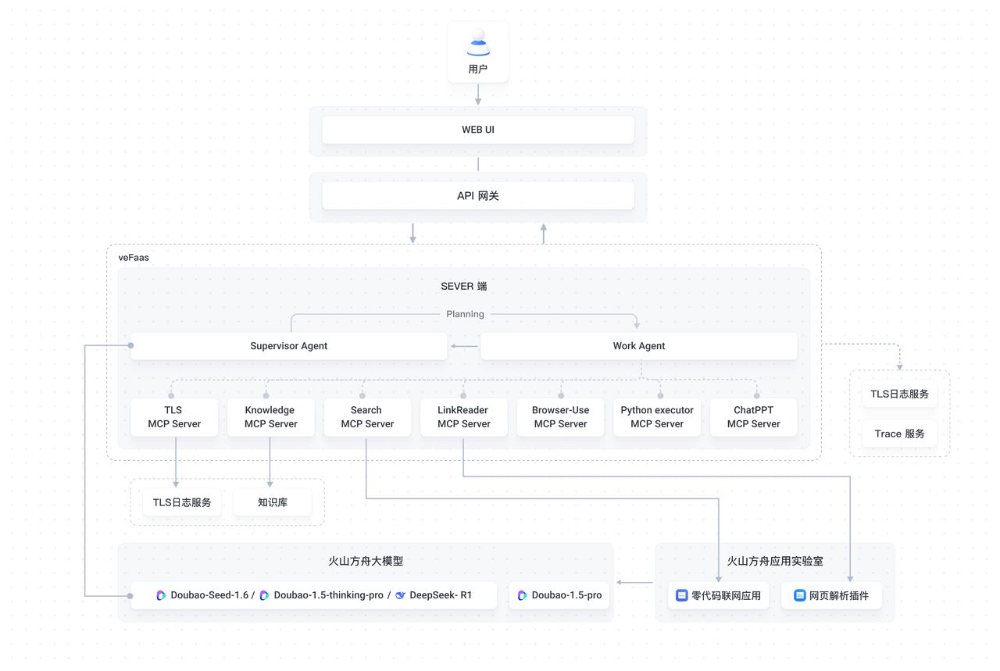
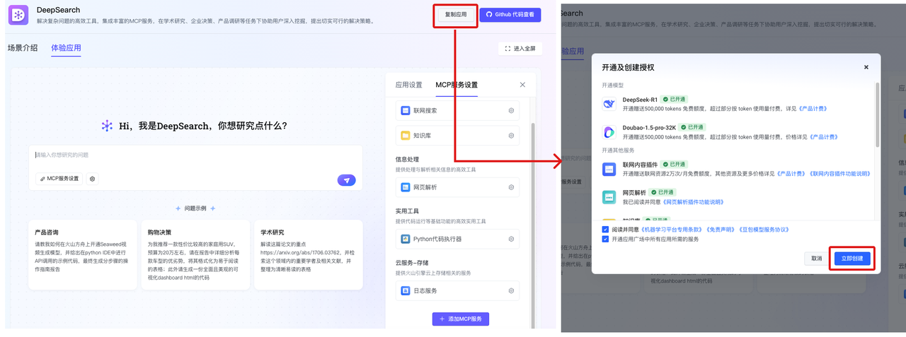
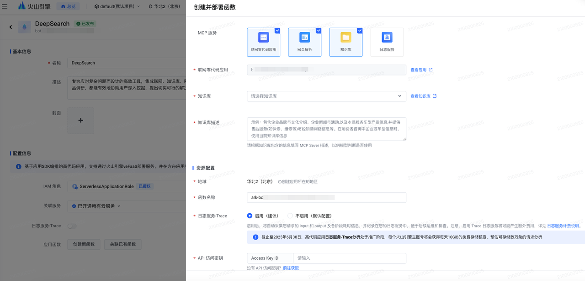
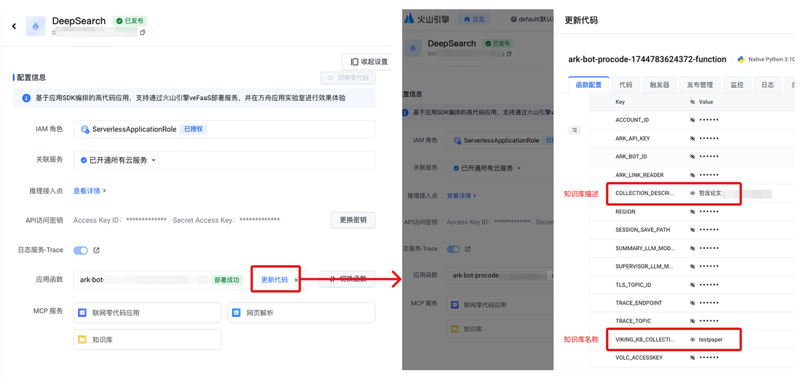
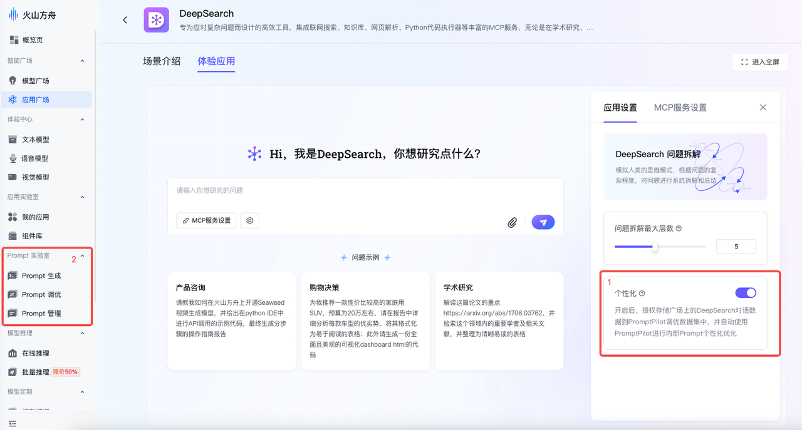
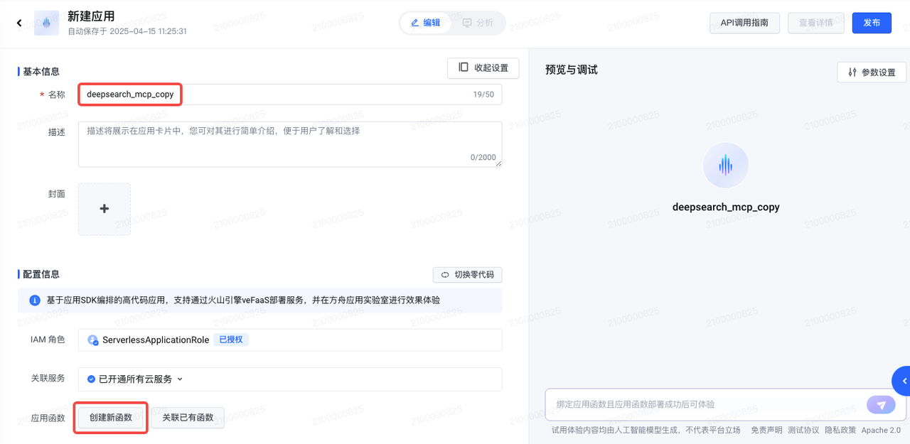
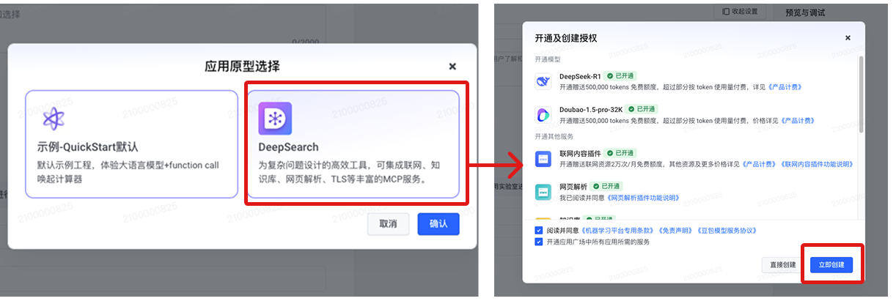
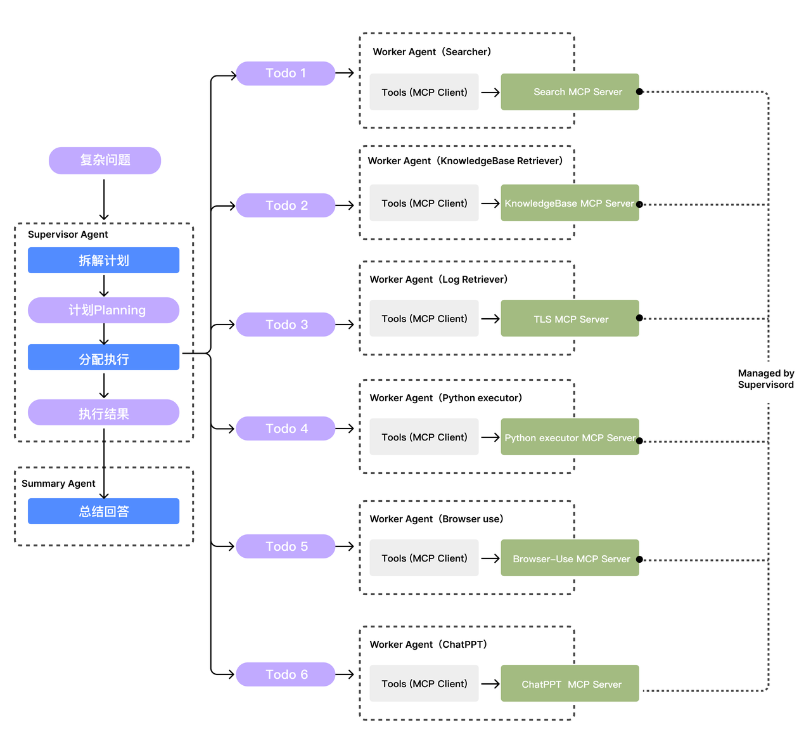

# Deep Search

## 应用介绍

DeepSearch 是一款专为处理复杂问题而精心设计的高效工具，可集成浏览器使用、联网搜索、知识库、网页解析、ChatPPT、Python 代码执行器等丰富的 MCP 服务。无论是学术研究、企业决策，还是产品调研场景，它都能助力用户深入挖掘信息，提出切实可行的解决策略。

**架构图**



## 费用说明

- **推理总结模型计费**
  - [Doubao-Seed-1.6-thinking](https://console.volcengine.com/ark/region:ark+cn-beijing/model/detail?Id=doubao-seed-1-6&projectName=default)大模型：开通赠送500,000 tokens [免费额度](https://www.volcengine.com/docs/82379/1399514)，超过部分按 token 使用量付费，详见 [计费说明](https://www.volcengine.com/docs/82379/1544106)
  - [Doubao-1.5-thinking-pro](https://console.volcengine.com/ark/region:ark+cn-beijing/model/detail?Id=doubao-1-5-thinking-pro&projectName=default)大模型：开通赠送500,000 tokens [免费额度](https://www.volcengine.com/docs/82379/1399514)，超过部分按 token 使用量付费，详见 [计费说明](https://www.volcengine.com/docs/82379/1099320#%E5%A4%A7%E8%AF%AD%E8%A8%80%E6%A8%A1%E5%9E%8B)。
  - [DeepSeek-R1 大模型](https://console.volcengine.com/ark/region:ark+cn-beijing/model/detail?Id=deepseek-r1)：开通赠送500,000 tokens [免费额度](https://www.volcengine.com/docs/82379/1399514)，超过部分按 token 使用量付费，详见 [计费说明](https://www.volcengine.com/docs/82379/1099320#%E5%A4%A7%E8%AF%AD%E8%A8%80%E6%A8%A1%E5%9E%8B)。
- **联网搜索服务计费**
  - **默认配置**：推荐使用火山方舟零代码联网应用（默认配置Doubao-1.5大模型+联网内容插件）作为搜索引擎，计费项如下：
    - [Doubao-1.5-pro-32k](https://console.volcengine.com/ark/region:ark+cn-beijing/model/detail?Id=doubao-1-5-pro-32k) / [Doubao-pro-32k](https://console.volcengine.com/ark/region:ark+cn-beijing/model/detail?Id=doubao-pro-32k)：开通赠送500,000 tokens [免费额度](https://www.volcengine.com/docs/82379/1399514)，超过部分按 token 使用量付费，价格详见 [计费说明](https://www.volcengine.com/docs/82379/1099320#%E5%A4%A7%E8%AF%AD%E8%A8%80%E6%A8%A1%E5%9E%8B)。
    - 联网内容插件：价格详见 [计费说明](https://www.volcengine.com/docs/82379/1338550)。
  - **自定义配置**：您也可以自行选择或创建可联网的[MCP Server](https://github.com/modelcontextprotocol/servers)。
    - **开源 搜索引擎 Tavily**：由 Tavily 官方进行收费，其计费规则详见 [计费说明](https://tavily.com/#pricing)。
    - **Model Context Protocol  servers**：更多信息请访问https://github.com/modelcontextprotocol/servers。
- **知识库（可选）**
  - 知识库提供知识管理的能力，支持对文档执行解析、切片、向量化、构建索引等处理后，进行知识检索。
  - 支持多种计费方式，价格详见[计费说明](https://www.volcengine.com/docs/82379/1263336)。
- **网页解析插件**
  - 网页解析插件可获取和解析 url 链接下的标题和内容。支持用户快速提取和检索网页、pdf等内容中有价值的信息。
  - 价格详见[计费说明](https://www.volcengine.com/docs/82379/1284852)。
- **浏览器使用**（可选）
  - 基于开源项目 Browser-use + Serverless浏览器沙箱，提供开箱即用的 Browser Agent 部署方案，用户可在 大模型生态广场 云部署Browser-Use MCP，并集成代码使用
  - 由 函数服务 按量计费
- **必优-ChatPPT**（可选）
  - 提供必优科技智能PPT服务，包括但不限于PPT创作，PPT美化，PPT生成等能力，用户可在 大模型生态广场 选用该MCP，并集成代码使用
  - 由 必优科技 官方收费
- **对象存储 TOS（可选）**
  - 对象存储 TOS 提供的海量、安全、低成本、易用、高可靠、高可用的分布式云存储服务。
  - 每个计费项都是单独计费，价格详见[计费说明](https://www.volcengine.com/docs/6349/78455)。
- **函数服务**
  - 函数服务支持用户快速创建和部署函数，并按需集成云上中间件与数据库产品。
  - 支持多种计费方式，价格详见[计费说明](https://www.volcengine.com/docs/6662/107454)。
- **日志服务（可选）**
  - 日志服务具备数据采集、存储、检索分析、加工、消费、投递、监控告警以及可视化等功能，适用于业务运维监控、数据统计分析等场景。
  - 支持多种计费方式，价格详见[计费说明](https://www.volcengine.com/docs/6470/105179)。
- **API 网关（可选）**
  - API 网关是基于云原生的高扩展、高可用的云上网关托管服务。
  - 采用按量计费的后付费方式，价格详见[计费说明](https://www.volcengine.com/docs/6569/185249)。

# 快速入门

下文将引导您通过火山方舟应用实验室功能，快速创建 DeepSearch MCP 应用实例。您可通过复制广场应用或新建高代码应用两种方式进行创建。

**方式一：复制广场同款应用**

1. 在[火山方舟模型广场](https://console.volcengine.com/ark/region:ark+cn-beijing/application)，进入DeepSearch应用界面详情页面，点击右上角【复制应用】，在随后弹出的【开通及创建授权】窗口中，确认相关服务是否一键开通，确认无误后点击【立即创建】。

    

2. 在【创建并部署函数】的引导页面，按需配置以下内容：

    - （可选）若开启知识库 MCP 服务，需选择可用于检索的知识库，并填写知识库描述作为 MCP Server 的描述，以便模型判断是否使用。
    - （可选）若开启日志服务MCP服务，需选择可用于检索的日志项目和主题。
    - （推荐）推荐开启【日志服务-Trace】功能，方便后续线上问题定位和排查，同时支持通过可视化的调试面板查看会话执行细节。

    

3. 完成配置后，点击【确定】开始自动部署。等待部署成功后，点击【立即体验】即可使用该应用。

    

4. 应用创建部署完成后，如需更改或补充知识库信息，可在编辑页面点击【更新代码】，并在【函数配置-环境变量】下进行更改。

    

5. （可选）Prompt的个性化调优。

    该应用的 system prompt 为预置统一设置，用户可根据自身业务需求自行修改。推荐通过以下两种方式，利用火山方舟的 Prompt 调优工具，以获得更好的模型回复效果：
    - 在应用实验室广场的DeepSearch应用中开启Prompt个性化优化，将优化后的结果复制到您应用的对应 Prompt 模块。
    - 直接进入火山方舟控制台的Prompt实验室进行Prompt调优。
   
   

**方式二：新建同款高代码应用**

1. 在火山方舟控制台侧边栏，选择 【应用实验室>我的应用】，点击页面中的【创建应用】，应用类型选择【高代码】，点击【确定创建】。

    

2. 在应用编辑页面中，填写应用名称，并点击【创建新函数】。

    

3. 在弹出的窗口中，应用原型选择【DeepSearch】，点击【确认】。在随后弹出的【开通及创建授权】窗口中，确认相关服务是否一键开通，确认无误后点击【立即创建】。

    

4. 后续操作与方式一的2-5步骤相同。

# 技术实现

## 核心思路

本项目采用 MultiAgent 思路实现，引入了 Supervisor、Worker 和 Summary 三种 Agent，以任务计划（Planning）为核心进行协作，并通过 MCP 协议集成各类工具 / 插件，从而能够完成相对复杂的任务。



在接收到用户的原始问题后，首先会由SupervisorAgent对问题进行任务拆解，得到一份执行计划（Planning），计划中包含多个子任务。
接着对于每个子任务，由SupervisorAgent根据任务内容，分配合适的WorkerAgent作为执行者，WorkerAgent在执行子任务期间会通过MCP协议和对应工具的MCP Server进行交互，从而实现工具的多次使用。
最终完成子任务的执行，并返回一份执行结果报告。在所有子任务完成后，由SummaryAgent根据各个子任务的执行结果，对原始问题进行最终的书面化总结回答。

## 代码架构

```shell
.
├── README.md
├── __init__.py
├── agent
│   ├── __init__.py
│   ├── agent.py
│   ├── summary.py # summary agent实现
│   ├── supervisor.py # supervisor agent实现
│   └── worker.py # worker agent实现
├── config
│   ├── __init__.py
│   └── config.py
├── deep_search
│   ├── __init__.py
│   └── deep_search.py # 整体流程封装
├── mcp_servers_config.json # mcp server配置文件
├── models
│   ├── __init__.py
│   ├── events.py # 输出事件的定义
│   ├── planning.py
│   ├── request.py
│   └── usage.py
├── poetry.lock
├── prompt # 存放各类prompt
│   ├── __init__.py
│   ├── planning.py
│   ├── summary.py
│   └── worker.py
├── pyproject.toml
├── requirements.txt # python库依赖
├── run.sh # 启动脚本
├── server
│   ├── __init__.py
│   ├── bot_server.py # server启动入口
│   └── server.py
├── state
│   ├── __init__.py
│   ├── deep_search_state.py
│   ├── file_state_manager.py
│   └── global_state.py
├── supervisord.conf # supervisord入口配置文件，用于拉起mcp servers
├── supervisord.d # 各个mcp server对应的supervisord配置
│   ├── link-search-mcp.conf
│   ├── tls-mcp.conf
│   ├── vdb-mcp.conf
│   ├── sandbox-mcp.conf
│   ├── browser-use-mcp.conf
│   └── ppt-mcp.conf
├── tools
│   ├── __init__.py
│   ├── hooks.py
└── utils
    ├── __init__.py
    ├── common.py
    ├── context.py
    ├── converter.py
    ├── message.py
    └── planning_holder.py
```

## API请求/响应结构说明

**API Host (POST)**

- https://ark.cn-beijing.volces.com/api/v3/bots/chat/completions

**Header**

- `Authorization: Bearer {ARK_API_KEY（替换为您的方舟API KEY）}`

**请求Body格式**

```json5
{
    "model": "bot-xxx", // 替换为您部署的高代码应用BOT ID
    "stream": true, // 只支持流式输出，必须设置为true
    "messages": [
        {
            "content": "帮我分析一下英伟达最近20个月的股价走势，给出长期和短期的投资建议",
            "role": "user"
        }
    ], // 不支持多轮对话，运行时只会取最后一条user message作为目标问题
    "metadata": {
        "max_plannings": 1, // 可选，控制最大拆解轮数
    }
}
```


**响应格式**

> 接口以SSE模式进行响应，每个包的格式如下：

```json5
{
    "id": "xxxx", // request-id
    "choices": [
        {
            "delta": {
                "content": "", // 模型的文本输出
                "role": "assistant",
                "reasoning_content": "" // 模型的思考输出
            },
            "index": 0
        }
    ],
    "created": 1744615796,
    "model": "bot-xxxx",
    "object": "chat.completion.chunk",
    "metadata": {
        "max_plannings": 1,
        // 本次运行的会话id
        "session_id": "xxxxxxx",
        // 各类事件输出，JSON string格式，可参考源码 models/events.py 文件获取各类事件的定义
        "event": "{\"type\":\"web_search\",\"status\":\"pending\",\"query\":\"xxx\"}"
    }
}
```